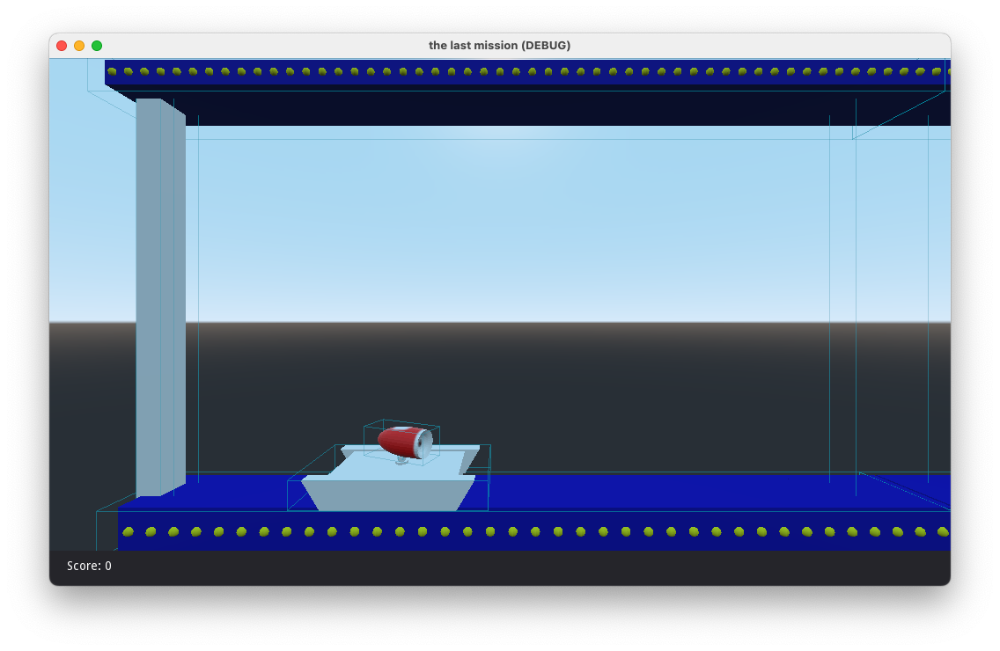

# The Last Mission 3D Clone
The idea of this project is improve my skills of godot3D doing something that I've got in mind since I learned the basics of blender 3D. Create a clone of the last mission in 3D, 

If you are looking for a remake of the last mission, I recommend you this project: [Last mission](https://github.com/dmitrysmagin/last-mission)

# Pictures

# Credits
* Game based on OperaSoft The last mission game

## Fonts used
* [Steps mono](https://fontlibrary.org/en/font/steps-mono)