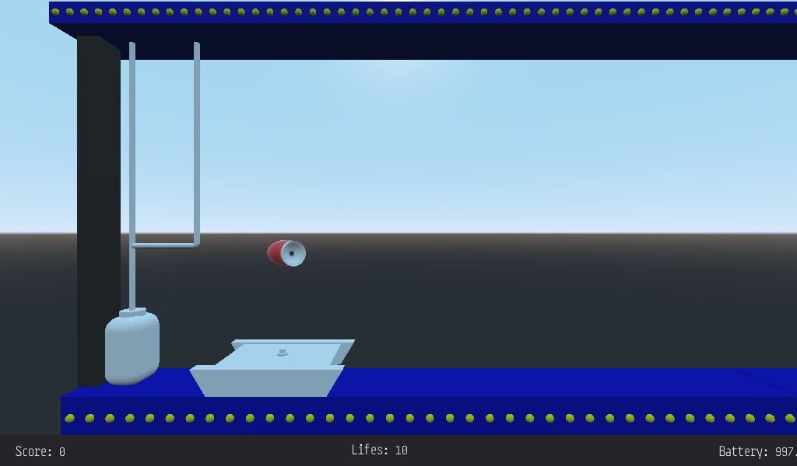

# The Last Mission 3D Clone
The idea of this project is improve my skills of godot3D doing something that I've got in mind since I learned the basics of blender 3D. Create a clone of the last mission in 3D, 

If you are looking for a remake of the last mission, I recommend you this project: [Last mission](https://github.com/dmitrysmagin/last-mission)

# Pictures




# How to help
1. Fork the project
2. clone your fork
3. Run it with godot
4. If you wish there is a small startup script that will allow you to skip the main menu, you need to create a start.json file with the following content:
```
{
  "start": "game"
}
```
5. Modify code, add assets, etc. 
6. Create P/R to my project


# Credits
* Game based on OperaSoft The last mission game

## Developer
* Jaume Singla Valls

## Fonts
* [Steps mono](https://fontlibrary.org/en/font/steps-mono)
* [LCD](https://fontlibrary.org/en/font/lcd#LCD-14)

## Sounds
The sounds are extracted from [Last mission project](https://github.com/dmitrysmagin/last-mission)